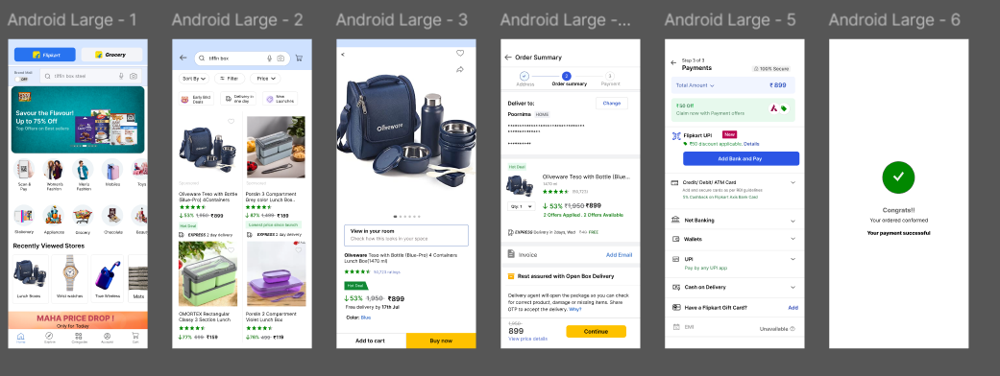

# FlipKart-Model-App

## 📌 Project Overview
This project is a Flipkart-inspired e-commerce UI design created using Figma. It focuses on designing a clean, modern, and user-friendly shopping interface.

## 🎯 Objective
To design an intuitive and visually appealing e-commerce user interface by applying UI/UX design principles.

## 🎨 Features
- Clean and modern UI design
- User-friendly navigation
- Product browsing interface
- Responsive layout design

## 🛠️ Tools Used
- Figma

### Design output

## 🔗 Figma Design Link
[View Design] (https://www.figma.com/proto/aX3AsTPcVSqVeyILd6gmaC/Untitled?page-id=0%3A1&node-id=1-3&p=f&viewport=693%2C-29%2C0.9&t=wRyjauslxZNKogez-1&scaling=scale-down&content-scaling=fixed&starting-point-node-id=1%3A3)

## 👩‍💻 Designer
Poornima S M
